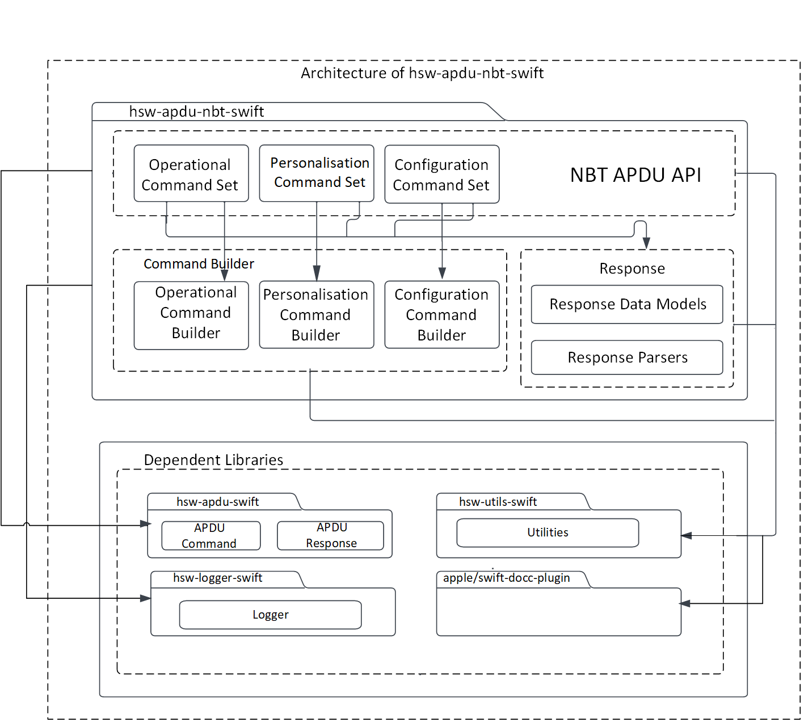
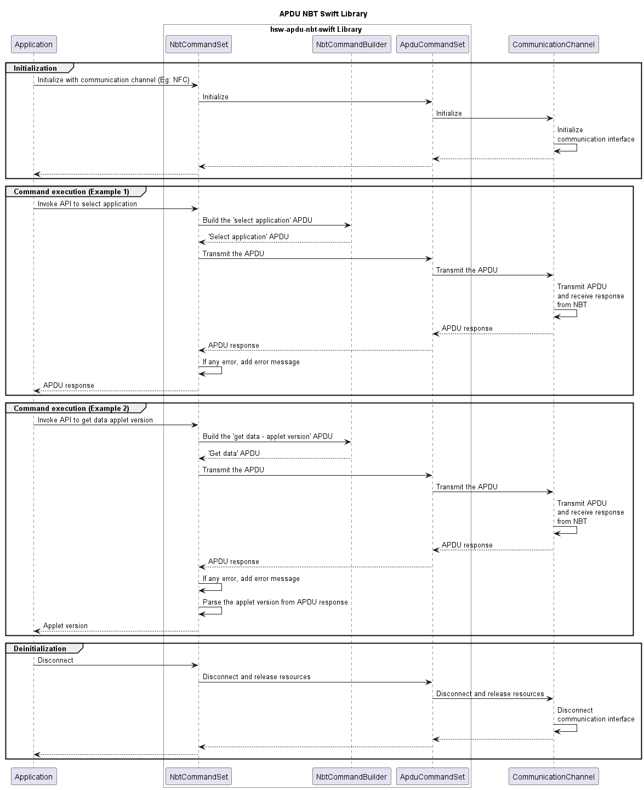

# NBT APDU Swift library

> Swift library to communicate using APDUs with the OPTIGA&trade; Authenticate NBT

The NBT APDU Swift library allows the iOS application to send C-APDUs and receive R-APDUs from the OPTIGA&trade; Authenticate NBT.
This library can be used with any communication channel, such as NFC and PCSC.

## Features

* Supports personalization and operational commands of OPTIGA&trade; Authenticate NBT applet
* Configuration of OPTIGA&trade; Authenticate NBT via its configurator applet
* Extensible for any communication channel such as NFC and PCSC

## Features not supported

* Pass-through APDUs

## Usage

1. Include the following headers

    ```swift
    import Foundation
    import InfineonApdu
    import InfineonApduNbt
    import InfineonLogger
    ```

2. Create a logger

    Refer to `hsw-logger-swift/README.md` example section for creating a logger.

    ```swift
    //TODO: Implement example logger 
    ```

    Initialize the created logger.

    ```swift
    //Initialize the Logger
    let exampleLogger : ExampleLogger = ExampleLogger()
    //Set the log level (The logger levels, in order of increasing verbosity, are: `none`, `error`, `warning`, `info`, `debug`, and `all`)
    exampleLogger.setLogLevel(loggerLevel: LoggerLevel.info)
    ```

3. Create a communication channel

    Refer to `hsw-channel-swift/README.md` example section for creating a communication channel interface.

    ```swift 
    // Implement example communication channel interface(e.g PCSC, NFC)
    // Code placeholder
    ```

    Initialize the created communication channel. 

    ```swift 
    // Initialize the Channel interface
    let exampleChannel = ExampleChannel()
    // Initialize the APDU channel with communication channel and logger
    let apduChannel =  ApduChannel(channel : ctkChannel, logger: exampleLogger) 
    ```

4. Initialize the command set

    ```swift
    // Create an instance of the NBT APDU command set
    let commandSet = try NbtCommandSet(channel: apduChannel)

    // Connect to the OPTIGA&trade; Authenticate NBT (It can return empty data)
    _ = try await apduChannel.connect(data: nil)
    ```

5. Communicate with the OPTIGA&trade; Authenticate NBT

    ```swift
    do {
    // Execute commands
    var apduResponse = try await commandSet.selectApplication()
    // Checks APDU Status word(SW) success, else throws an error
    _ = try apduResponse.checkOK() // Returns the Apdu response object
    _ = apduResponse.getSW() // Returns response status word
    //Log the Apdu response
    exampleLogger.info(header: "APDU response", data: apduResponse.getData())

    let ccFileId: UInt16 = 0x00E2
    apduResponse = try await commandSet.selectFile(fileId: ccFileId)
    _ = try apduResponse.checkOK()
    //Log the Apdu response
    exampleLogger.info(header: "APDU response", data: apduResponse.getData())
    
    let expectedLen: UInt16 = 0x10
    let offset: UInt16 = 0x0000
    apduResponse = try await commandSet.readBinary(offset: offset, expectedLen: expectedLen)
    _ = try apduResponse.checkOK()
    _ = apduResponse.getData() // Returns response data bytes
    //Log the Apdu response
    exampleLogger.info(header: "APDU response", data: apduResponse.getData())

    } catch let error as ApduError {
            print(error.localizedDescription)
    }
    ```

## Architecture

This image shows the software architecture of the library. 



## Components

* **Command set**
    This command set acts as the API interface for the iOS application. This module is responsible for coordinating the building of APDU commands, sending the commands to the secure element through the communication interface, and receiving response from the secure element. 

* **Command builder**
    The command builder helps in framing the command APDUs according to the OPTIGA&trade; Authenticate NBT applet specification. 

* **Response parser**
    The response parser helps in decoding the response APDUs including response data and status word according to the OPTIGA&trade; Authenticate NBT applet specification. 

## Interaction

This UML sequence diagram describes the interaction between the components.



## Directory structure

The library directory is structured according to the Pitchfork Layout.

```text
hsw-apdu-nbt-swift
|-- LICENSES/                       # Includes list of licenses used for the library package
|-- Sources/                        # Includes source files of the library
|-- docs/                           # Includes images and the generated API reference
|-- .gitignore                      # Library specific gitignore file
|-- .swiftlint.yml                  # Includes Swift lint configurations
|-- Package.swift                   # Includes build configurations of the library
`-- README.md                       # Overview of hsw-apdu-nbt-swift library
```

## Dependencies

* **hsw-apdu-swift**
    The APDU Swift library helps in building the APDU command bytes and parses the APDU response bytes according to the ISO/IEC 7816-4 specification.
* **hsw-utils-swift**
    The utilities library provides the utility methods such as byte conversions, string conversions, and bit operations. 
* **apple/swift-docc-plugin**
    This dependent library supports building documentation for the Swift library.

## References

- Infineon Technologies AG: *OPTIGA&trade; Authenticate NBT, Extended Datasheet*
