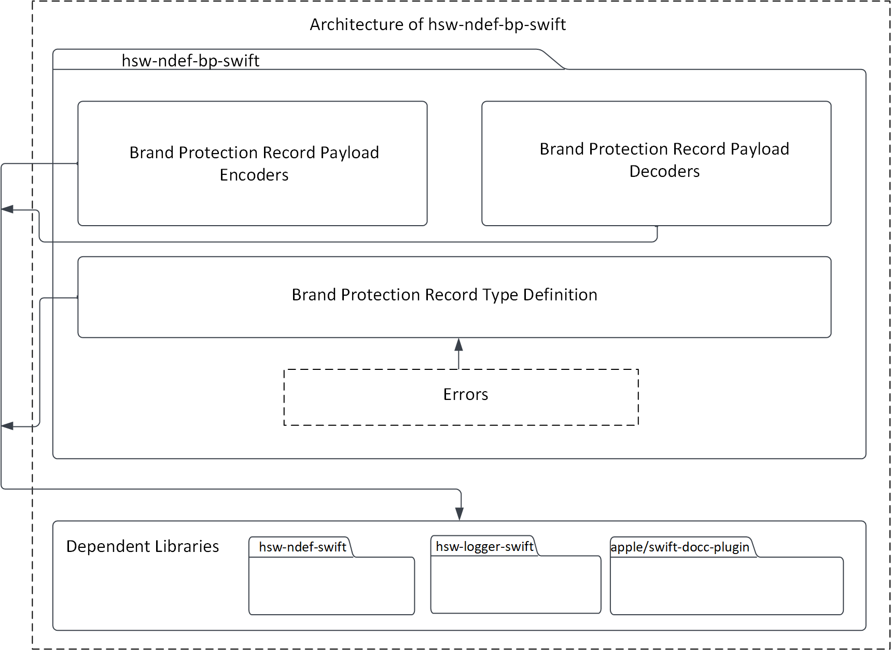
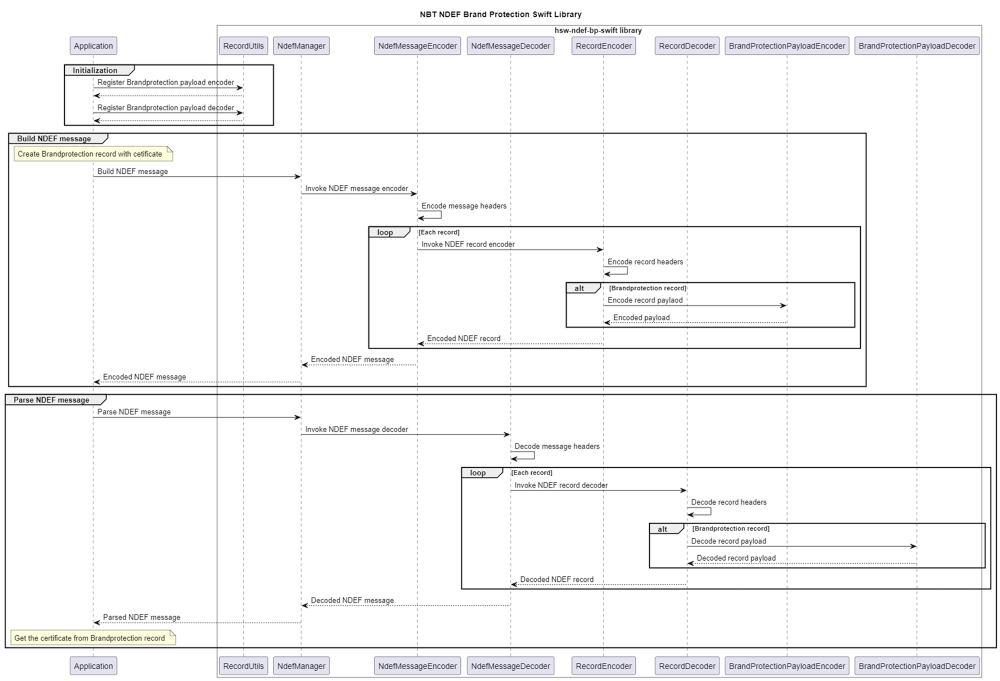

# NFC brand protection record swift library

The NFC brand protection record library is an extension to the NDEF Swift library to create and parse the OPTIGA&trade; Authenticate NBT's brand protection record.

The record type URN is `urn:nfc:ext:infineon.com:nfc-bridge-tag.x509`.

The brand protection record is created with the type `infineon.com:nfc-bridge-tag.x509`.

This record allows passing x509 certificate in the payload. The x509 certificate in the payload is of type [Apple Security SecCertificate](https://developer.apple.com/documentation/security/seccertificate).

## Usage

1. Register the brand protection encoder and decoder into the NDEF Swift library

    ```swift
    // Imports
    import Foundation
    import InfineonNdef
    import InfineonNdefBrandProtection

    // Register the encoder and decoder
    RecordUtils.registerEncoder(recordType: BrandProtectionRecord.brandProtectionRtdType,
                                encoder: BrandProtectionRecordPayloadEncoder())
    RecordUtils.registerDecoder(recordType: BrandProtectionRecord.brandProtectionRtdType,
                                decoder: BrandProtectionRecordPayloadDecoder())
    ```

2. Use the brand protection record

    ```swift
    do {
    // Build the record
    let certificateData = Data([
        0x48, 0x65, 0x6c, 0x6c, 0x6f, 0x2c, 0x20, 0x54, 0x68, 0x69,
        0x73, 0x20, 0x69, 0x73, 0x20, 0x65, 0x78, 0x74, 0x65, 0x72,
        0x6e, 0x61, 0x6c, 0x20, 0x52, 0x65, 0x63, 0x6f, 0x72, 0x64,
        0x20, 0x45, 0x78, 0x61, 0x6d, 0x70, 0x6c, 0x65, 0x2e
    ])
    let brandProtectionRecord = BrandProtectionRecord(certificate: certificateData)

    // Encode into NDEF message
    let message = NdefMessage(ndefRecords: [brandProtectionRecord])
    let messageBytes = try message.toByteArray(includeLength: true)

    // The encoded message can be written to the NFC tag
    // Decode the encoded message
    let decodedMessage = try NdefManager.decode(data: messageBytes)

    // Decode the record
    let decodedRecords = decodedMessage.getNdefRecords()

    let decodedBrandProtectionRecord = decodedRecords[0] as? BrandProtectionRecord

    _ = try decodedBrandProtectionRecord?.getCertificate()

    // Work with the record...

    } catch {
        // ...
    }
    ```

## Architecture

This image shows the software architecture of the library.



## Components

* **Brand protection record type definitions**

    These record type definitions (RTD) can be used to build the brand protection record. 

* **Brand protection record payload encoder & decoder**

    The encoder and decoder component contains the Brand Protection payload encoder and decoder, which can be used to encode and decode the payload details into a byte array.

## Interaction

This UML sequence diagram describes the interaction between the components.



## Directory structure

The library directory is structured according to the Pitchfork Layout.

```text
hsw-ndef-bp-swift
|-- LICENSES/                       # Includes list of licenses used for the library package
|-- Sources/                        # Includes source files of the library
|-- docs/                           # Includes images and the generated API reference
|-- .gitignore                      # Library specific gitignore file
|-- .swiftlint.yml                  # Includes Swift lint configurations
|-- Package.swift                   # Includes build configurations of the library
`-- README.md                       # Overview of hsw-ndef-bp-swift library
```

## Dependencies

* **hsw-ndef-swift**

    This dependent library creates and parses the NDEF records and messages.

* **apple/swift-docc-plugin**

    This dependent library supports building documentation for the Swift library.

## References

* Infineon Technologies AG: *OPTIGA&trade; Authenticate NBT, Extended Datasheet*
* NFC Data Exchange Format (NDEF), Technical Specification, NFC Forum™, NDEF 1.0
* NFC Record Type Definition (RTD), Technical Specification, NFC Forum™, RTD 1.0
