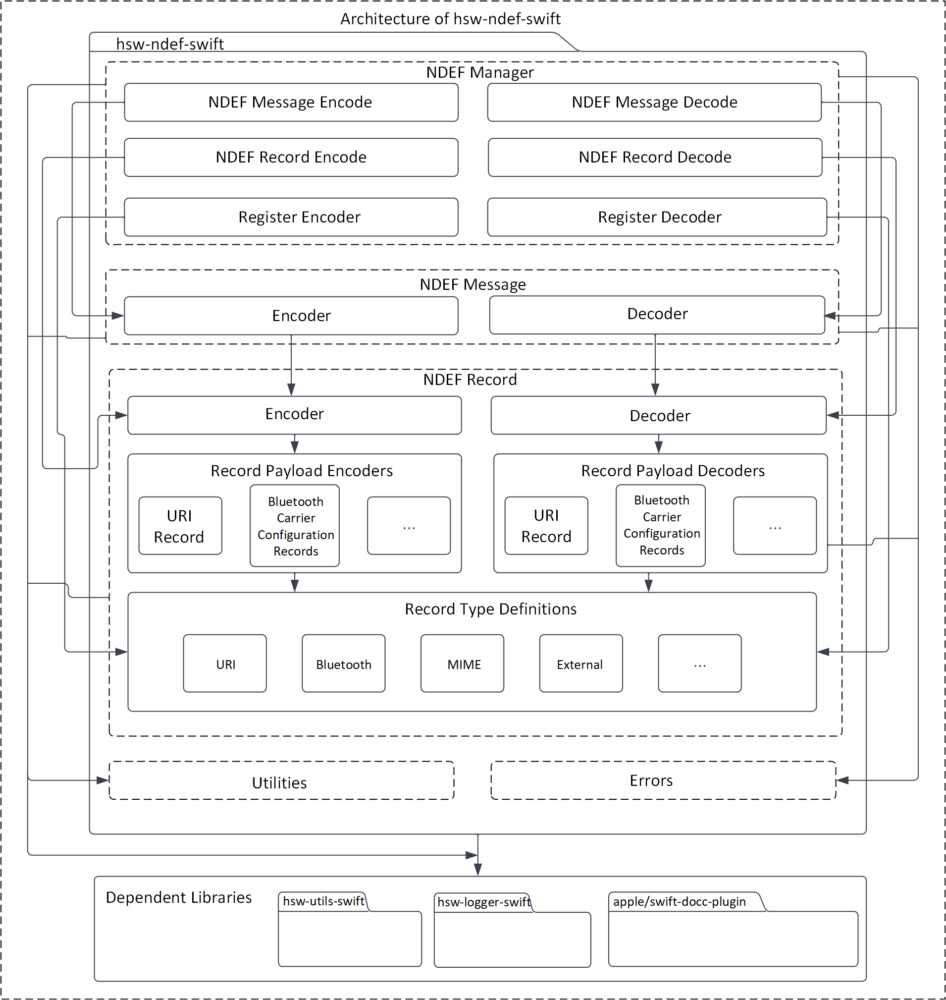
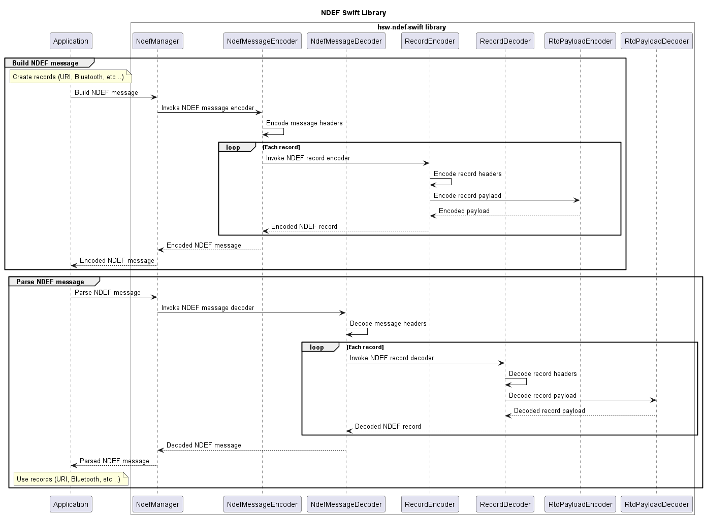

# NFC data exchange format (NDEF) Swift library
> Swift library to encode and decode the NDEF messages

The NFC data exchange format (NDEF) specification by [NFC Forum](https://nfc-forum.org/) defines a common data format to exchange information between NFC Forum devices. An NDEF message is composed of one or more NDEF records. Each NDEF record contains the record type information and a payload.

This Swift library provides support to build and parse the NDEF messages, with support for common NDEF record type definitions. This library is extensible for addition of new record type definitions.

## Features

* Build and parse the NDEF messages
* Build and parse the NDEF records
* Supported records:
    * URI record
    * Bluetooth connection handover records (For static connection handover)
        * Bluetooth record `(application/vnd.bluetooth.ep.oob)`
        * Bluetooth LE record `(application/vnd.bluetooth.le.oob)`
        * Handover select record
        * Alternative carrier record
        * Error record
    * MIME type record
    * External type record

## Features not supported

* Record chunks

## Usage

1. Include the following headers

```swift
import Foundation
import InfineonNdef
```

2. Encode the URI record

```swift
do {
    // Build URI record
    let uriRecord = try UriRecord(uriIdentifier: UriRecord.UriIdentifier.uriHttpsWww, uri: "infineon.com")
    
    // Build external type record
    let extRecordType = "infineon.com:nfc-test".data(using: NdefConstants.defaultCharset)!
    let extPayload = "Infineon Technologies".data(using: NdefConstants.defaultCharset)!
    let extRecord = NdefRecord(tnf: NdefConstants.tnfExternalType, isChuncked: false, type: extRecordType, id: Data(), payload: extPayload)
} catch {}
```

3. Encode the NDEF message

```swift
// Encode the records into an NDEF message
let message = NdefMessage(ndefRecords: [uriRecord, extRecord])
let messageBytes = try NdefManager.encode(message: message)
let messageBytesWithLength = try NdefManager.encode(message: message, includeLength: true)
```
4. Decode the NDEF message

```swift
// Decode the encoded NDEF message
let decodedMessage = try NdefManager.decode(data: messageBytes)
```

5. Decode the URI record

```swift
// Decode the records
let decodedRecords = decodedMessage.getNdefRecords()
let decodedUriRecord = decodedRecords[0] as? UriRecord
let decodedExtRecord = decodedRecords[1] as? NdefRecord

// Work with the records
_ = decodedUriRecord?.getUriWithIdentifier()
_ = decodedExtRecord?.getPayload()
_ = decodedExtRecord?.getRecordType()?.getType()
```
## Architecture

This image shows the software architecture of the library.



## Components

* **NDEF manager**

    This component can be used by the application to encode/decode the NDEF messages and records. This class also provides methods to register the new record payload encoders and decoders to support the new record types.

* **NDEF message**

    This component holds a collection of NDEF records. This class can be used to build an NDEF message with records.

* **Record type definitions (RTD)**

    The RTD directory contains the record types that are in-built supported by the library. These record type definitions can be used to build the records. Example: `UriRecord(uriIdentifier: UriRecord.UriIdentifier.URI_HTTPS_WWW, uri: "infineon.com")`

* **NDEF record**

    This component contains the standard record details such as the record headers, type, and payload. This abstract record is inherited to `WellKnown`, `Mime`, and `ExternalType` records. These records can be used to build new records.

* **Record payload encoders and decoders**

    The encoders and decoders component contains the payload encoders and decoders, which can be used to encode and decode the payload details into a byte array.

* **Utilities**

    This component contains the commonly used constants of this library.

* **Errors**

    The errors directory contains the error types thrown by this library at runtime.

## Interaction
This UML sequence diagram describes the interaction between the components.



## Directory structure
The library directory is structured according to the Pitchfork Layout.

```
hsw-ndef-swift
|-- LICENSES/                       # Includes list of licenses used for the library package
|-- Sources/                        # Includes source files of the library
|-- docs/                           # Includes images and the generated API reference
|-- .gitignore                      # Library specific gitignore file
|-- .swiftlint.yml                  # Includes Swift lint configurations
|-- Package.swift                   # Includes build configurations of the library
`-- README.md                       # Overview of hsw-ndef-swift library
```

## Dependencies

* **hsw-utils-swift**

    This dependent library contains the utilities to perform the byte array conversions.
  
* **apple/swift-docc-plugin**

    This dependent library supports building documentation for the Swift library.

## References

* NFC Data Exchange Format (NDEF), Technical Specification, NFC Forum™, NDEF 1.0
* NFC Record Type Definition (RTD), Technical Specification, NFC Forum™, RTD 1.0
* URI Record Type Definition (RTD), Technical Specification, NFC Forum™, RTD-URI 1.0
* Connection Handover, Technical Specification, NFC Forum™, CH 1.4
* Bluetooth Secure Simple Pairing Using NFC, Application Document, NFC Forum™, BTSSP 1.3
