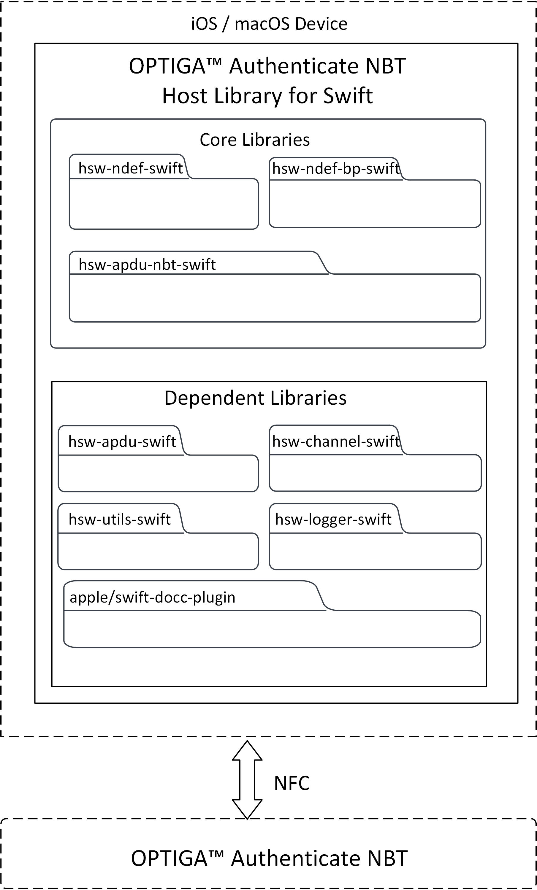
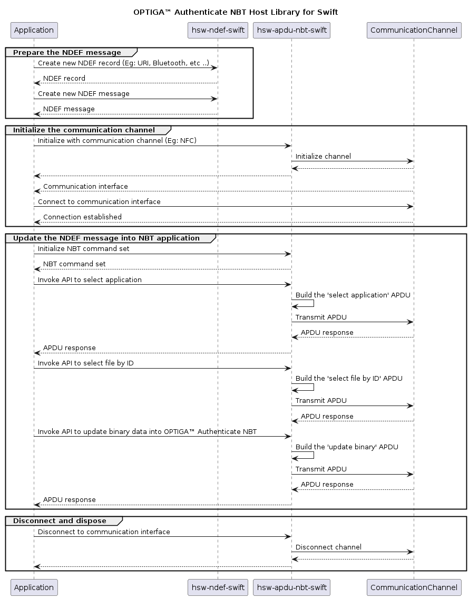

# OPTIGA&trade; Authenticate NBT Host Library for Swift: User guide

The OPTIGA&trade; Authenticate NBT Host Library for Swift offers an extensive API to interact with the OPTIGA&trade; Authenticate NBT and to utilize its full functionality. The host library is mainly intended to be used in iOS/macOS applications interfacing to the OPTIGA&trade; Authenticate NBT via NFC (for example: mobile phones or NFC readers).

## Scope and purpose

This guide describes the features and functionality of OPTIGA&trade; Authenticate NBT Host Library for Swift including architecture overviews of core libraries and basic descriptions. It also conveys the basic procedure to integrate the provided host library into existing iOS and macOS applications.

## Intended audience

This guide is primarily intended for:

- iOS application developers who target to integrate the OPTIGA&trade; Authenticate NBT Host Library for Swift into iOS applications
- macOS application developers who target to integrate the OPTIGA&trade; Authenticate NBT Host Library for Swift in macOS applications using NFC readers

## Quick navigation

- [Key features](#key-features)
- [Host library architecture](#host-library-architecture)
  - [Core libraries](#core-libraries)
  - [Dependent libraries](#dependent-libraries)
- [Directory structure](#directory-structure)
- [Swift build system](#swift-build-system)
- [Integrating into an existing Project](#integrating-into-an-existing-project)
  - [Swift based project](#swift-based-project)
  - [Xcode IDE project](#xcode-ide-project)
- [Library interaction](#library-interaction)
- [Library usage](#library-usage)
- [References](#references)

## Key features

- Sends command APDUs (C-APDU) and receives response APDUs (R-APDU) from the OPTIGA&trade; Authenticate NBT
- Configuration of OPTIGA&trade; Authenticate NBT via its configurator application
- Personalization and operational commands to support simplified interaction with the OPTIGA&trade; Authenticate NBT
- Enables the host application to build, encode, and decode NDEF records and messages with the NDEF library
- Supports building and parsing NDEF records of types "NFC Forum well known type" and "NFC Forum external type"
- Supports OPTIGA&trade; Authenticate NBT brand protection record

## Host library architecture

This host library provides high-level command abstractions to communicate with the OPTIGA&trade; Authenticate NBT. It includes multiple sub-libraries in its package. The core libraries are designed to be platform-independent.

### Core libraries

The OPTIGA&trade; Authenticate NBT Host Library for Swift provides three core libraries to interact with the OPTIGA&trade; Authenticate NBT.

- [hsw-apdu-nbt-swift](../Sources/hsw-apdu-nbt-swift/README.md)
- [hsw-ndef-swift](../Sources/hsw-ndef-swift/README.md)
- [hsw-ndef-bp-swift](../Sources/hsw-ndef-bp-swift/README.md)



#### hsw-apdu-nbt-swift

This library allows the application to send C-APDUs to the OPTIGA&trade; Authenticate NBT and receive R-APDUs from the OPTIGA&trade; Authenticate NBT. This library can be used with communication channels such as NFC and PCSC.

#### hsw-ndef-swift

The NFC Data Exchange Format (NDEF) specification by [NFC Forum](https://nfc-forum.org/) defines a common data format to exchange information between NFC Forum devices. This library provides support to build and parse the NDEF messages, with support for common NDEF record type definitions. This library is extensible for the addition of new record type definitions.

#### hsw-ndef-bp-swift

The NFC brand protection record library is an extension to the NDEF library to create and parse the NFC brand protection records for the OPTIGA&trade; Authenticate NBT. This extended library includes NDEF records and parsers to provide the core brand protection functionality of the OPTIGA&trade; Authenticate NBT. Brand protection-specific encoding and decoding are handled by the library itself. But this library depends on the hsw-ndef-swift library for registering its records and for further NDEF record and message manipulations.

### Dependent libraries

The core libraries are dependent on several other libraries. A Detailed description of these dependent libraries is provided below.

| Dependent&nbsp;libraries | Description |
|---------------------|--------------|
|[hsw-apdu-swift](../Sources/hsw-apdu-swift/README.md)|This APDU library helps in building the APDU command bytes and parses the APDU response bytes according to the ISO/IEC 7816-4 specification.|
|[hsw-channel-swift](../Sources/hsw-channel-swift/README.md)| This dependent library provides the communication protocol interface for the OPTIGA&trade; Authenticate NBT APDU core library. This protocol provides interfaces such as initialize, transceive, and terminate to communicate with the OPTIGA&trade; Authenticate NBT.|
|[hsw-utils-swift](../Sources/hsw-utils-swift/README.md)|This dependent library provides the utility methods such as for byte conversions, string conversions, and bit operations.|
|[hsw-logger-swift](../Sources/hsw-logger-swift/README.md)|This dependent library provides the methods to log different levels of log messages.|

## Directory structure

The directory structure of the OPTIGA&trade; Authenticate NBT Host Library for Swift follows the [pitchfork](https://github.com/vector-of-bool/pitchfork/blob/develop/data/spec.bs) layout including core and dependent libraries.

```text
hsw-nbt-swift
|-- LICENSES/                       # Includes licenses used by the host library
|-- Sources/                        # Includes the core and dependent libraries
|   |-- InfineonNbt/                # Includes source file of the host library package
|   |-- hsw-apdu-nbt-swift/         # Core library
|   |-- hsw-apdu-swift/             # Dependent library
|   |-- hsw-channel-swift/          # Dependent library         
|   |-- hsw-logger-swift/           # Dependent library
|   |-- hsw-ndef-bp-swift/          # Core library
|   |-- hsw-ndef-swift/             # Core library
|   `-- hsw-utils-swift/            # Dependent library           
|-- docs/                           # Includes userguide, images and the generated API reference
|-- .gitignore                      # Library specific gitignore file
|-- .swiftlint.yml                  # Includes Swift lint configurations
|-- Package.swift                   # Includes build configurations of the library
`-- README.md                       # Overview of hsw-nbt-swift library
```

## Swift build system

The OPTIGA&trade; Authenticate NBT Host Library for Swift is integrated with [Swift](https://swift.org/) Package Manager to ensure a smooth and consistent workflow for building iOS and macOS applications.
The host library supports the respective OS with the following versions only:

- iOS version 15 and higher
- macOS version 11 and higher

### Build as library

The Swift host library uses the Swift Package Manager to build.

```sh
# Build the code
swift build
```

### Documentation

The OPTIGA&trade; Authenticate NBT Host Library for Swift API documentation is available in the "docs/" folder.
For more information on the API, build the [Swift-DocC](https://github.com/apple/swift-docc) documentation.
To generate documentation using Swift-DocC, navigate to the root directory of OPTIGA&trade; Authenticate NBT Host Library for Swift in the terminal and run the below command.

```sh
swift package generate-documentation
```

This will generate the DocC documentation and save it to `.build/plugins/Swift-DocC/outputs` of the host library.

- Navigate to `.build/plugins/Swift-DocC/outputs` path and right click on the required `.doccarchive` file (for example: `InfineonNbt.doccarchive`) and select 'Open with Xcode'.
- Now the DocC documentation can be viewed in the Xcode documentation previewer.

## Integrating into an existing project

Using the Swift Package Manager as a build tool, integrating the host library into an existing project is straightforward. Here is how you can add the host library as a dependency into a Swift project:

### Swift based project

- Place the OPTIGA&trade; Authenticate NBT Host Library for Swift into the Sources/hsw-nbt-swift folder of the existing application
- Open the Package.swift file in the existing application project
- Add the host library's path in Package.swift as dependency
    ```swift
    dependencies: [
    // Dependencies declare other packages that this package depends on.
    .package(path: "Sources/hsw-nbt-swift")
      ]
    ```
- Add the host library as a dependency to the existing project target
    ```swift
    targets: [
        // Targets are the basic building blocks of a package. A target can define a module or a test suite.
        // Targets can depend on other targets in this package, and on products in packages this package depends on.
        .target(
            name: "ExistingSwiftProject",
      dependencies: [
      .product(name: "InfineonNbt", package: "hsw-nbt-swift")
            ]
          )
      ]
    ```
- Save the Package.swift file
- The OPTIGA&trade; Authenticate NBT Host Library for Swift is now integrated into the existing Swift project and ready for use
- Import the host library's packages into the existing codebase and start using the host library's functionality
    ```swift
    # Including as separate packages
    import InfineonNdef
    import InfineonApduNbt
    import InfineonNdefBrandProtection
    ```

### Xcode IDE project

To integrate the OPTIGA&trade; Authenticate NBT Host Library for Swift into an existing iOS or macOS application in Xcode IDE, follow the steps below.

- Place the OPTIGA&trade; Authenticate NBT Host Library for Swift inside the root path of the existing iOS/macOS application project
- Open Xcode IDE
- Open the existing iOS/macOS application project
- Select the Xcode project file and navigate to the "Package Dependencies" tab
- Click '+' icon
- In the dialog box that appears, click "Add Local" option
- Browse and select the host library's path
- Click "Add Package". In the next dialog box that appears, make sure the right package and target is selected and click "Add Package"
- The host library is now integrated into Xcode project and ready for use
- Import the Swift file(s) into the existing codebase and start using the host library's functionality
    ```swift
    # Including as separate packages
    import InfineonNdef
    import InfineonApduNbt
    import InfineonNdefBrandProtection
    ```

## Library interaction

An example interaction between the core libraries is explained below with a use case - *Update URI data in an application file of the OPTIGA&trade; Authenticate NBT*. The hsw-ndef-swift library is used to prepare a URI record and update it on the file system of the OPTIGA&trade; Authenticate NBT using the hsw-apdu-nbt-swift library.



## Library usage

The usage of the host library's API to update a URI record in the OPTIGA&trade; Authenticate NBT device application file is illustrated below.

1. Include the required headers from the host library

    ```swift
    //ndef headers
    import InfineonNdef
    import InfineonNdefBrandProtection

    //apdu headers
    import InfineonApduNbt
    import InfineonUtils
    import InfineonApdu
    import InfineonLogger
    ```

2. Create a logger and initialize it. Refer to the example section in `hsw-logger-swift/README.md` for creating a logger

    ```swift
    //TODO: Implement example logger 

    //Initialize the Logger
    let exampleLogger : ExampleLogger = ExampleLogger()
    //Set the log level (The logger levels, in order of increasing verbosity, are: `none`, `error`, `warning`, `info`, `debug`, and `all`)
    exampleLogger.setLogLevel(loggerLevel: LoggerLevel.info)
    ```

3. Create a communication channel and initialize it. Refer to the example section in `hsw-channel-swift/README.md` for creating a communication channel interface

    ```swift 
    // Implement example communication channel interface(For example: PCSC, NFC)
    // Code placeholder

    // Initialize the Channel interface
    let exampleChannel = ExampleChannel()
    // Initialize the APDU channel with communication channel 
    let apduChannel = ApduChannel(channel : ctkChannel, logger: exampleLogger) 
    ```

4. Initialize the command set

    ```swift
    // Create an instance of the NBT APDU command set
    let commandSet = try NbtCommandSet(channel: apduChannel)

    // Connect to the OPTIGA&trade; Authenticate NBT (It can return empty data)
    _ = try await apduChannel.connect(data: nil)
    ```

5. Update the NDEF message with the URI record in the NDEF file (File ID: 0xE104)

    ```swift
    do {
        //...
        
        // Build URI record
        let uriRecord = try UriRecord(uriIdentifier: UriRecord.UriIdentifier.uriHttpsWww, uri: "infineon.com")

        // Encode the records into an NDEF message
        let message = NdefMessage(ndefRecords: [uriRecord])
        let uriMessageBytes = try NdefManager.encode(message: message)
        let uriMessageBytesWithLength = try NdefManager.encode(message: message, includeLength: true)
        //Log the Apdu response
        exampleLogger.info(header: "Uri Message Bytes", data: uriMessageBytesWithLength)


        var apduResponse = try await commandSet.selectApplication()
        // Checks SW success, else throws an error
        _ = try apduResponse.checkOK()
        // Returns response status word
        _ = apduResponse.getSW()
        //Log the Apdu response
        exampleLogger.info(header: "APDU response", data: apduResponse.getData())

        apduResponse = try await commandSet.selectFile(fileId: 0xe104)
        _ = try apduResponse.checkOK()
        //Log the Apdu response
        exampleLogger.info(header: "APDU response", data: apduResponse.getData())

        let offset: UInt16 = 0x0000
        apduResponse = try await commandSet.updateBinary(offset: offset, data: uriMessageBytesWithLength)
        _ = try apduResponse.checkOK()
        // Returns response data bytes
        _ = apduResponse.getData()
        //Log the Apdu response
        exampleLogger.info(header: "APDU response", data: apduResponse.getData())
    } catch {}
    ```

## References

- Infineon Technologies AG: *OPTIGA&trade; Authenticate NBT, Extended Datasheet*
